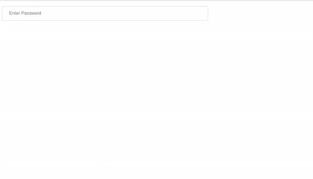

# AngularJS - Password Input Component

An AngularJS based Password Input component, which provides input field to add password as a text / password property with validation. The password value is automatically validated on change event. You can also disable password field using disable props.

## Table of contents

- [Browser Support](#browser-support)
- [Demo](#demo)
- [Getting started](#getting-started)
- [Usage](#usage)
- [Available Props](#available-props)
- [Methods](#methods)
- [Want to Contribute?](#want-to-contribute)
- [Collection of Components](#collection-of-components)
- [Changelog](#changelog)
- [License](#license)
- [Keywords](#Keywords)

## Browser Support

|  |  |  |  |  |
| ---------------------------------------------------------------------------------------- | ------------------------------------------------------------------------------------------- | ---------------------------------------------------------------------------------------- | ---------------------------------------------------------------------------------- | ---------------------------------------------------------------------------------------------------------------------------- |
| 83.0 ✔                                                                                   | 77.0 ✔                                                                                      | 13.1.1 ✔                                                                                 | 83.0 ✔                                                                             | 11.9 ✔                                                                                                                       |

## Demo

[](https://github.com/weblineindia/AngularJS-Password-Input/passwordNg.gif)

## Getting started

Install the npm package:

```bash
npm install angular-weblineindia-password
#OR
yarn add angular-weblineindia-password
```

If your angular verson is diffrent then install fontawesome :

Using `ng add`:

```
# See Compatibility table below to choose a correct version
$ ng add @fortawesome/angular-fontawesome@<version>
```

Using [Yarn](https://yarnpkg.com)
```
$ yarn add @fortawesome/fontawesome-svg-core
$ yarn add @fortawesome/free-solid-svg-icons
# See Compatibility table below to choose a correct version
$ yarn add @fortawesome/angular-fontawesome@<version>
```

Using [NPM](https://www.npmjs.com/)
```
$ npm install @fortawesome/fontawesome-svg-core
$ npm install @fortawesome/free-solid-svg-icons
# See Compatibility table below to choose a correct version
$ npm install @fortawesome/angular-fontawesome@<version>
```

|@fortawesome/angular-fontawesome|Angular|ng-add|
|-|-|-|
|0.1.x|5.x|not supported|
|0.2.x|6.x|not supported|
|0.3.x|6.x && 7.x|not supported|
|0.4.x, 0.5.x|8.x|not supported|
|0.6.x|9.x|supported|

## Usage

Use the `<angular-weblineindia-password>` component:

```typescript
import { NgModule } from '@angular/core';
import { PasswordModule } from 'angular-weblineindia-password';

@NgModule({
  imports: [PasswordModule]
})
export class AppModule {}
```
Add typescript on .ts file

```typescript
export class AppComponent {

 passwordValue: any = {
    value: "",
    placeholder: "Enter Password",
    name: "password",
    id: "password",
    disabled: "false",
    tabindex: "1",
    paswordMinLength: 3,
    passwordFieldType: 'password',
    paswordMaxLength:255,
    passwordErrorName:'The password field must be at least 3 characters'
  };

 onChangePassword(event) {
    if (event.target.value.trim() === "") {
      this.passwordValue.value = event.target.value
        .replace(/^[^-\s][a-zA-Z0-9_\s-]+$/, "")
        .trim();
    } else {
      this.passwordValue.value = event.target.value;
    }
  }

  onFocusPassword(event) {
    event.target.placeholder = "";
  }
  onBlurPassword(event) {
    event.target.placeholder = this.passwordValue.placeholder;
  }
}
```

Add html on .html file

```html
<lib-password
  [placeholder]="passwordValue.placeholder"
  [name]="passwordValue.name"
  [value]="passwordValue.value"
  [id]="passwordValue.id"
  [disabled]="passwordValue.disabled"
  [tabindex]="passwordValue.tabindex"
  [paswordMinLength]="passwordValue.paswordMinLength"
  [paswordMaxLength]="passwordValue.paswordMaxLength"
  [passwordFieldType]="passwordValue.passwordFieldType"
  [passwordErrorName]="passwordValue.passwordErrorName"
  (change)="onChangePassword($event)"
  (focus)="onFocusPassword($event)"
  (blur)="onBlurPassword($event)"
></lib-password>

```


## Available Props

| Prop           | Type    | default     | Description        |
| -------------- | ------- | ----------- | ------------------ |
| paswordMinLength          | Number  |    3         | min length for password          |
| paswordMaxLength          | Number  |  255   |  max length for password          |
| passwordFieldType     | String  | password    | field type of password(like text or password)           |
| passwordErrorName | String  |  The password field must be at least 3 characters           | error name for password      |
| placeholder    | String  | password | password placeholder    |
| disabled       | Boolean | false       | disable password field  |
| name           | String  | password | name for password field |
| tabindex       | Number  | 1           | password tabIndex       |
| id             | String  | password | name for password field |
| hide           | Boolean | false       | for hide password field |
| isViewPassword           | Boolean | true       | To hide/show eye icon |
| value           | String |        | value for password  |


## Methods

| Name     | Description                                             |
| -------- | ------------------------------------------------------- |
| focus    | Gets triggered when the password input field receives focus. |
| blur   | Gets triggered when the password input field loses focus.    |
| change | Gets triggered every time password got changed.              |

## Want to Contribute?

- Created something awesome, made this code better, added some functionality, or whatever (this is the hardest part).
- [Fork it](http://help.github.com/forking/).
- Create new branch to contribute your changes.
- Commit all your changes to your branch.
- Submit a [pull request](http://help.github.com/pull-requests/).

---

## Collection of Components

We have built many other components and free resources for software development in various programming languages. Kindly click here to view our [Free Resources for Software Development](https://www.weblineindia.com/software-development-resources.html)

---

## Changelog

Detailed changes for each release are documented in [CHANGELOG.md](./CHANGELOG.md).

## License

[MIT](LICENSE)

[mit]: https://github.com/weblineindia/AngularJS-Password-Input/blob/master/LICENSE

## Keywords

angular-weblineindia-password, password-input, angular-components, angularjs, angularjs-component, password-input-component, angularjs-password-input, password-validation, angularjs-password-validation
